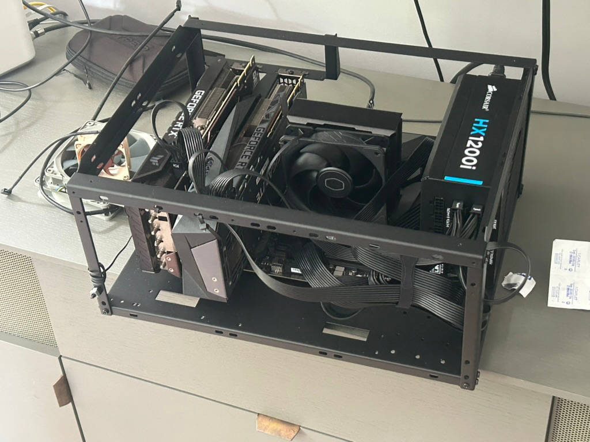
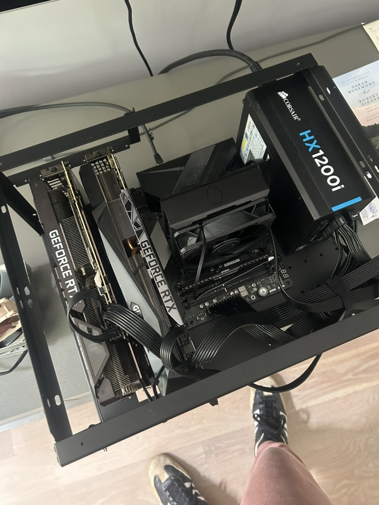

# GRUNT parts list

Goals: cool, cheap, fast decode.

The main consideration here vs a gaming or mining build is the PCIe bandwidth.  This matters for running the cards with tensor parallelism, which splits the model onto each card and speeds up inference.

| PCIe Version | Speed per Lane | x1 Bandwidth | x4 Bandwidth | x8 Bandwidth | x16 Bandwidth |
|---|---:|---:|---:|---:|---:|
| PCIe 3.0 | 8.0 GT/s | ~0.985 GB/s | ~3.94 GB/s | ~7.88 GB/s | ~15.75 GB/s |
| PCIe 4.0 | 16.0 GT/s | ~1.969 GB/s | ~7.88 GB/s | ~15.75 GB/s | ~31.51 GB/s |
| PCIe 5.0 | 32.0 GT/s | ~3.938 GB/s | ~15.75 GB/s | ~31.51 GB/s | ~63.02 GB/s |

Our board/cpu supports PCIe 4.0 at x8 bandwidth.

These are all consumer grade parts.  Server motherboards/memory have more slots but are hard to find now.

For sanity checking your build use this: https://pcpartpicker.com/list/

### Case
[Open air test bench](https://www.amazon.com/dp/B0FXXDQGWK?ref=ppx_yo2ov_dt_b_fed_asin_title)

I just wanted something that was open air. I originally got [this mining case](https://www.amazon.com/Mining-Computer-Currency-Bitcoin-Accessories/dp/B09CNG58R1/ref=sr_1_3?crid=1M1KFNUQ14LNH&dib=eyJ2IjoiMSJ9.opYyjrnRNvy30-Ln6ZjFxW1G8tWXkU1u8L49LI2Q6EGEVAg1-Di2LKiSeSHSVqn-tKi3zd4w529HgmxXJ4fXhQ7XD43nnikpaWZ5nWwASxkWVStW4JA1YLaWjUBhJytHVR3FOlw5Z2sGu9AHWuo1xMItmdZL-JirJaTQGrAUjXhTtymRmOKCiziveQfRdIba7aIQUSJmod_1r0JylRGL9X2Xh2li6dPTBRiV52x_i-Gu4gsqvG5NmuKIN4mq2Rh7RXsg4c1ldEx8aS0xwyajuPS93eGJGWz7SPlYI2atbnI.ArIyzIzbbLzOPZh-X3ewoH-hFlNcs0MlQ-X2xpD9LaQ&dib_tag=se&keywords=mining+case&qid=1780711310&s=electronics&sprefix=mining+ca%2Celectronics%2C227&sr=1-3) which has the GPUs sit above, but I quickly 
learned PCIE riser cables are not the most reliable when above 15cm and with pcie 4.0+.  YMMV. 

Unfortunately the cards do sit pretty close together.

### Fans

[2x Noctua 120mm fans](https://www.amazon.com/dp/B07CG2PGY6?ref=ppx_yo2ov_dt_b_fed_asin_title)

Ziptied to the back and front of the cards, blowing from the back of the case to the front.

- For these cards, the backplate gets the hottest because of the vram.  The fans blow air across the plates.  Intake from the back, exhaust through the front.
- I also added [a heatsink](https://www.amazon.com/dp/B089QJQY17?ref=ppx_yo2ov_dt_b_fed_asin_title) to sit on the backplate of the right card.  The case sits with the left side on the bottom and right side (power supply side) on the top.

### CPU
AMD Ryzen™ 9 5900XT 16-Core, 32-Thread
- Originally bought the AMD Ryzen 5 5500 but it didn't support pci 4.0.
- I started with intel but moved to AMD AM4 for cost reasons.  Both are fine.

### Motherboard
Asus ROG Crosshair VIII Hero AM4 ATX AMD DDR4 Motherboard

I chose this board because it supports - PCIe 4.0 x8 / x8 for tensor parallelism.

If I could have found a similarly priced board with more slots, I would have, but I don't think I'll upgrade this with more cards in the future.

### CPU Cooler
[Cooler Master Hyper 212 Black](https://www.amazon.com/dp/B07H25DYM3?ref=ppx_yo2ov_dt_b_fed_asin_title)

The stock cooler is fine but my cpu didn't come with one.  Comes with thermal paste.

### GPUs

1 Gigabyte card, one MSI card.  The gigabyte card was throttling due to high temps so I took it apart and replaced the thermal pads (Gelid Ultimate 1,2,3mm).  The thickness of these pads matters a lot.  I will add some pictures of this eventually.
### Power supply

[Corsair HX1200i 1200W](https://www.ebay.com/itm/358475724644)

I undervolt the 2 3090s from 350w -> 200w for thermal reasons (at ~5% performance loss), but I just wanted something reliable.
Corsair is a great brand and 1600w was overkill.

### Memory

16gb ddr4 ram.  I forget which brand.

### Storage

[Kingston 1tb NVME SSD](https://www.amazon.com/dp/B0DBR3DZWG?ref=ppx_yo2ov_dt_b_fed_asin_title&th=1)

$163 is stupid for storage but it's enough to hold enough models.  Storage speed only matters when loading the models.

## Hit the road

https://github.com/noonghunna/club-3090/blob/master/docs/GETTING_STARTED.md
